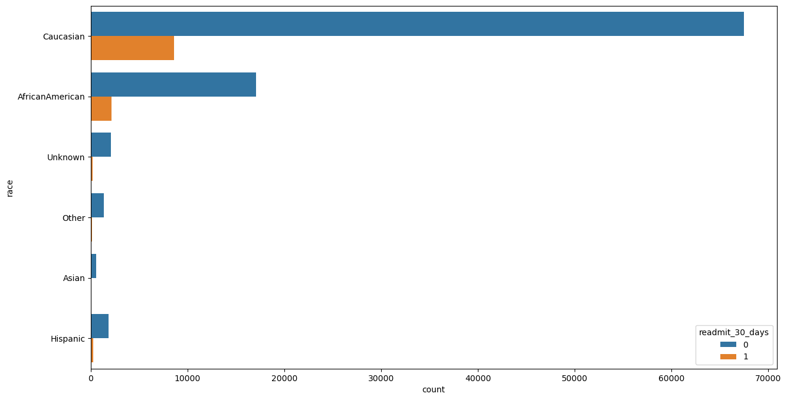

# CS340 Commputational Ethics Assignment 2
Zhiyuan Zhong
12110517

## 1. Identify Potential Bias

In the dataset `diabetic_preprocessed.csv`, the data type of each columns are as follows:

```
race                        object
gender                      object
age                         object
discharge_disposition_id    object
admission_source_id         object
time_in_hospital             int64
medical_specialty           object
num_lab_procedures           int64
num_procedures               int64
num_medications              int64
primary_diagnosis           object
number_diagnoses             int64
max_glu_serum               object
A1Cresult                   object
insulin                     object
change                      object
diabetesMed                 object
medicare                      bool
medicaid                      bool
had_emergency                 bool
had_inpatient_days            bool
had_outpatient_days           bool
readmitted                  object
readmit_binary               int64
readmit_30_days              int64

```

### Check whether data are binary, multi-categorical, or continuous

```
race
Caucasian          76099
AfricanAmerican    19210
Unknown             2273
Hispanic            2037
Other               1506
Asian                641


gender
Female             54708
Male               47055
Unknown/Invalid        3


age
Over 60 years          68541
30-60 years            30716
30 years or younger     2509


discharge_disposition_id
Discharged to Home    60234
Other                 41532


admission_source_id
Emergency    57494
Referral     30856
Other        13416


time_in_hospital
3     17756
2     17224
1     14208
4     13924
5      9966
6      7539
7      5859
8      4391
9      3002
10     2342
11     1855
12     1448
13     1210
14     1042


medical_specialty
Missing                   49949
Other                     16825
InternalMedicine          14635
Emergency/Trauma           7565
Family/GeneralPractice     7440
Cardiology                 5352


num_lab_procedures
1      3208
43     2804
44     2496
45     2376
38     2213
       ... 
120       1
132       1
121       1
126       1
118       1


num_procedures
0    46652
1    20742
2    12717
3     9443
6     4954
4     4180
5     3078


num_medications
13    6086
12    6004
11    5795
15    5792
14    5707
      ... 
70       2
75       2
81       1
79       1
74       1


primary_diagnosis
Other                     68512
Respiratory Issues        14423
Diabetes                   8757
Genitourinary Issues       5117
Musculoskeletal Issues     4957


number_diagnoses
9     49474
5     11393
8     10616
7     10393
6     10161
4      5537
3      2835
2      1023
1       219
16       45
10       17
13       16
11       11
15       10
12        9
14        7

max_glu_serum
Norm    2597
>200    1485
>300    1264

A1Cresult
>8      8216
Norm    4990
>7      3812

insulin
No        47383
Steady    30849
Down      12218
Up        11316

change
No    54755
Ch    47011

diabetesMed
Yes    78363
No     23403

readmitted
NO     54864
>30    35545
<30    11357

readmit_binary
0    54864
1    46902

readmit_30_days
0    90409
1    11357
```

- Binary: `gender`, `medicare`, `medicaid`, `had_emergency`, `had_inpatient_days`, `had_outpatient_days`, `readmit_binary`, `readmit_30_days`, `change`, `diabetesMed`, `discharge_disposition_id`
- Multi-categorical: `race`, `age`, `admission_source_id`, `medical_specialty`, `primary_diagnosis`, `max_glu_serum`, `A1Cresult`, `insulin`,`readmitted`
- Continuous: `time_in_hospital`, `num_lab_procedures`, `num_procedures`, `num_medications`, `number_diagnoses`

### Sample sizes of the groups according to Sensitive Features

- Age and Readmission

The data is biased towards samples with older age. The data size grows as the age increases.

- Race and Readmission

The data is biased towards `Caucasian` and `AfricanAmerican`. `Caucasian` has the largest sample size.

- Gender and Readmission

The data is relatively balanced.

## 2. Model Training

Please refer to the `train.ipynb` file for the data analysis and model training. A Logistic Regression model is trained with an accuracy of 0.63 on the test set.

## 3. Quantify Fairness

Please refer to the `fairness.ipynb` for more details.
The results are in the form of `fairness metric`, `indicator`, `pairwise synthesis`.

### Demographic Parity

```
Demographic Parity

AfricanAmerican | 0.3929
Caucasian | 0.3807
Other | 0.3062
Hispanic | 0.3496
Unknown | 0.2237
Asian | 0.2657

max difference: ('AfricanAmerican', 'Unknown') | 0.1692
min difference: ('AfricanAmerican', 'Caucasian') | 0.0122
smallest ratio: ('Unknown', 'AfricanAmerican', 0.5694565307125041)
largest ratio: ('Caucasian', 'AfricanAmerican', 0.9689210129843422)
maximum indicator: AfricanAmerican | 0.3929
```

### Equalized Opportunity

```
Equalized Opportunity

AfricanAmerican | 0.0158
Caucasian | 0.1444
Other | 0.0007
Hispanic | 0.0011
Unknown | 0.0008
Asian | 0.0003

max difference: ('Caucasian', 'Asian') | 0.1441
min difference: ('Other', 'Unknown') | 0.0001
smallest ratio: ('Asian', 'Caucasian', 0.0023049102184119576)
largest ratio: ('Other', 'Unknown', 0.9089898039918192)
maximum indicator: Caucasian | 0.1444
```

### Equalized Odds


- Equalized Odds (True)
```
AfricanAmerican | 0.0158
Caucasian | 0.1444
Other | 0.0007
Hispanic | 0.0011
Unknown | 0.0008
Asian | 0.0003

max difference: ('Caucasian', 'Asian') | 0.1441
min difference: ('Other', 'Unknown') | 0.0001
smallest ratio: ('Asian', 'Caucasian', 0.0023049102184119576)
largest ratio: ('Other', 'Unknown', 0.9089898039918192)
maximum indicator: Caucasian | 0.1444
```
- Equalized Odds (False)
```
AfricanAmerican | 0.0705
Caucasian | 0.2693
Other | 0.0044
Hispanic | 0.0067
Unknown | 0.0050
Asian | 0.0013

max difference: ('Caucasian', 'Asian') | 0.2680
min difference: ('Other', 'Unknown') | 0.0006
smallest ratio: ('Asian', 'Caucasian', 0.005002870499466908)
largest ratio: ('Other', 'Unknown', 0.8849557522123895)
maximum indicator: Caucasian | 0.2693
```

### Conditional Statistical Parity

- L = ('Male', '30-60 years')
```
AfricanAmerican | 0.3582
Caucasian | 0.3179
Other | 0.2883
Hispanic | 0.2909
Unknown | 0.1444
Asian | 0.1731
Maximum indicator: 0.3582

max difference: ('AfricanAmerican', 'Unknown') | 0.2138
min difference: ('Other', 'Hispanic') | 0.0026
smallest ratio: Unknown, AfricanAmerican | 0.4032122169562928
largest ratio: Other, Hispanic | 0.991180981595092
```

- L = ('Male', 'Over 60 years')
```
AfricanAmerican | 0.4205
Caucasian | 0.3995
Other | 0.3350
Hispanic | 0.4741
Unknown | 0.2959
Asian | 0.3131
Maximum indicator: 0.4741

max difference: ('Hispanic', 'Unknown') | 0.1782
min difference: ('Unknown', 'Asian') | 0.0172
smallest ratio: Unknown, Hispanic | 0.6241701019743979
largest ratio: Caucasian, AfricanAmerican | 0.950069733141813
```

- L = ('Male', '30 years or younger')
```
AfricanAmerican | 0.2366
Caucasian | 0.2049
Other | 0.0833
Hispanic | 0.2941
Unknown | 0.0000
Asian | 0.0000
Maximum indicator: 0.2941

max difference: ('Hispanic', 'Unknown') | 0.2941
min difference: ('Unknown', 'Asian') | 0.0000
smallest ratio: Unknown, AfricanAmerican | 0.0
largest ratio: Caucasian, AfricanAmerican | 0.8660663399065315
```
- L = ('Female', '30-60 years')
```
AfricanAmerican | 0.3651
Caucasian | 0.3422
Other | 0.2288
Hispanic | 0.2682
Unknown | 0.1329
Asian | 0.1923
Maximum indicator: 0.3651

max difference: ('AfricanAmerican', 'Unknown') | 0.2322
min difference: ('AfricanAmerican', 'Caucasian') | 0.0229
smallest ratio: Unknown, AfricanAmerican | 0.3640682217929125
largest ratio: Caucasian, AfricanAmerican | 0.9373856225754337
```
- L = ('Female', 'Over 60 years')
```
AfricanAmerican | 0.4320
Caucasian | 0.4048
Other | 0.3373
Hispanic | 0.3784
Unknown | 0.2364
Asian | 0.3010
Maximum indicator: 0.4320

max difference: ('AfricanAmerican', 'Unknown') | 0.1956
min difference: ('Caucasian', 'Hispanic') | 0.0264
smallest ratio: Unknown, AfricanAmerican | 0.5471725125268433
largest ratio: Caucasian, AfricanAmerican | 0.9371029642618253
```
- L = ('Female', '30 years or younger')
```
AfricanAmerican | 0.2771
Caucasian | 0.3319
Other | 0.4000
Hispanic | 0.0526
Unknown | 0.0000
Asian | 0.0000
Maximum indicator: 0.4000

max difference: ('Other', 'Unknown') | 0.4000
min difference: ('Unknown', 'Asian') | 0.0000
smallest ratio: Unknown, AfricanAmerican | 0.0
largest ratio: AfricanAmerican, Caucasian | 0.8349008938981733
```

## 4. Evaluation

### Demographic Parity

Demographic Parity measures the equality of prediction outcomes across different sensitive groups. It is achieved when the probability of a certain prediction is not dependent on sensitive group membership.

The results indicate that the `African American` group has the highest proportion of positive predictions (0.3929), followed by the `Caucasian` group (0.3807).  

The maximum difference is observed between the `African American` and `Unknown`.

In this metric, the model is biased towards the `African American` and `Caucasian` groups, with the `Asian` and `Unknown` groups having the lowest proportion of being readmitted.

### Equalized Opportunity

It means the protected and unprotected groups should have equal true positive rates.

The `Caucasian` group has the highest TPR (0.1444). Others have much lower TPR values. The maximum difference is observed between the `Caucasian` and `Asian` groups (0.1441). 

The smallest ratio is found between the `Asian` and `Caucasian` groups.

In this metric, the model is biased towards the `Caucasian` group, with the `Asian` group having the lowest TPR.

### Equalized Odds

Equalized Odds means the protected and unprotected groups should have equal true positive rates and false positive rates.

We discuss the false positive rates, since the true positive rates are the same as the `Equalized Opportunity` metric.

The `Caucasian` group has the highest FPR(0.2693). Others have much lower FPR values. The maximum difference is still observed between the `Caucasian` and `Asian` groups. 

The smallest ratio is found between the `Asian` and `Caucasian` groups.

In this metric, the model is biased towards the `Caucasian` group, tending to predict the `Caucasian` group as readmitted.

### Conditional Statistical Parity

Conditional Statistical Parity means the protected and unprotected groups should have equal true positive rates conditioned on a third variable(legitimate factors L).

L = `gender, age`

- L = ('Male', '30-60 years')

      The `African American` group has the highest proportion of positive predictions (0.3582), followed by the `Caucasian` group (0.3179). The maximum difference is observed between the `African American` and `Unknown` groups.

      The model is biased towards the `African American` and `Caucasian` groups, with the `Asian` and `Unknown` groups having the lowest proportion of being readmitted.

- L = ('Male', 'Over 60 years')

      The `Hispanic` group has the highest proportion of positive predictions (0.4741), followed by the `AfricanAmerican` group . The maximum difference is observed between the `Hispanic` and `Unknown` groups.

      The model is biased towards the `Hispanic` and `AfricanAmerican` groups, with the `Asian` and `Unknown` groups having the lowest proportion of being readmitted.

- L = ('Male', '30 years or younger')

      Same as above, the model is biased towards the `Hispanic` and `AfricanAmerican` groups, with the `Asian` and `Unknown` groups having the lowest proportion of being readmitted (**even  `0`!**).

- L = ('Female', '30-60 years')

      Same. Biased towards the `Caucasian` and `AfricanAmerican` groups, with the `Asian` and `Unknown` groups having the lowest proportion of being readmitted.

- L = ('Female', 'Over 60 years')

      Same. Biased towards the `Caucasian` and `AfricanAmerican` groups, with the `Asian` and `Unknown` groups having the lowest proportion of being readmitted.

- L = ('Female', '30 years or younger')

      Biased towards the `Caucasian` and `Other` groups, with the `Asian` and `Unknown` groups having the lowest proportion of being readmitted (**even  `0`**!). 

## 5. Conclusion

The model is mostly biased towards the `Caucasian` group, then the `AfricanAmerican` and `Hispanic` groups, indicated by the tendency to predict these groups as readmitted. While the `Asian` and `Unknown` groups have the lowest proportion of being readmitted. 

This is related to the imbalance of the dataset, where the `Caucasian` group has the largest sample size, then the `AfricanAmerican` group. The `Asian` and `Unknown` groups have the smallest sample size.


## References
- [kaggle](https://www.kaggle.com/code/iabhishekofficial/prediction-on-hospital-readmission)
