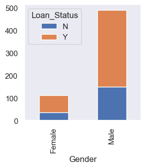
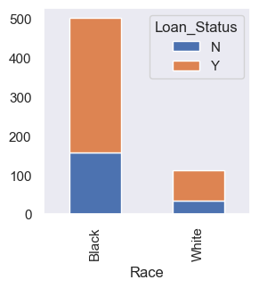
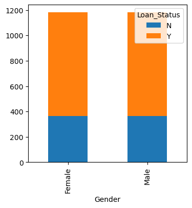
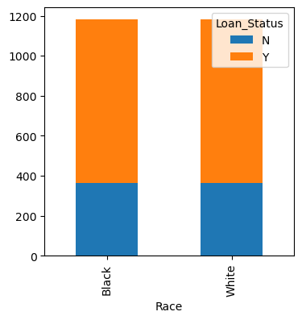

# CS340 Assignment 3: Bias Mitigation

Zhiyuan Zhong 12110517

## Note 

**Please check the `README.md` for the instructions on how to run the code.**

- Prediction model file with bias exists: `models`
- Bias test before mitigation, including test methods and test results: `original_bias.ipynb`
- The model file with bias mitigated: `models`
- Bias test after mitigation, including test methods and test results: `new_bias.ipynb`


## 1. Model Selection

Following the reference baseline, I used `LogisticRegression`, `DecisionTreeClassifier`, `RandomForestClassifier`, and `XGBClassifier`. The test results are in files `Logistic_Regression.csv`, `Decision_Tree.csv`, `Random_Forest.csv`, and `XGBoost.csv`, repsectively. The original models files are `logistic_regression_model.joblib`, `decision_tree_model.joblib`, `random_forest_model.joblib`, and `xgboost_model.joblib`, respectively.

## 2. Bias Evaluation

Following Assignment 2, I used `Demographic Parity` as the fairness metric. Below are the scores for each model.

### Logistic Regression

```
Gender: 
Male 0.9595959595959596
Female 0.9
Difference:  0.059595959595959536
Ratio:  0.9378947368421052

Race: 
Black 0.9760479041916168
White 0.925
Difference:  0.051047904191616755
Ratio:  0.9476993865030675
```

### Decision Tree

```
Gender: 
Male 0.632996632996633
Female 0.5571428571428572
Difference:  0.07585377585377584
Ratio:  0.8801671732522798

Race: 
Black 0.7005988023952096
White 0.55
Difference:  0.1505988023952095
Ratio:  0.7850427350427351
```

### Random Forest

```
Gender: 
Male 0.7676767676767676
Female 0.6428571428571429
Difference:  0.12481962481962472
Ratio:  0.837406015037594

Race: 
Black 0.8143712574850299
White 0.685
Difference:  0.12937125748502987
Ratio:  0.841139705882353
```

### XGBoost

```
Gender: 
Male 0.6868686868686869
Female 0.6571428571428571
Difference:  0.02972582972582971
Ratio:  0.9567226890756302

Race: 
Black 0.7544910179640718
White 0.62
Difference:  0.1344910179640718
Ratio:  0.8217460317460318
```

We can see that the models are mainly baised towards `Male` and `Black` groups. 

Here we use the average of `Race` and `Gender` demographic parity ratio as the fairness score. The higher the score, the less biased the model is. 

```
Model('DecisionTree', fair_score=0.8326049541475075)
Model('RandomForest', fair_score=0.8392728604599735)
Model('XGB', fair_score=0.889234360410831)
Model('Logistic', fair_score=0.9427970616725864)
```

## 3. Bias Mitigation

### 3.1 Select Better Algorithm

From [section 2](#2-bias-evaluation), we can see that the `Logistic Regression` model is the least biased. While the `DecisionTree` based model is more biased. Thus by using the `Logistic Regression` model, we can mitigate the bias.

### 3.2 Expand the Dataset

We can expand the dataset by adding more data to the underrepresented groups. This can help the model to learn more about the underrepresented groups and thus reduce the bias.

**Original Data:**

Gender distribution:


Race distribution:


The data is biased towards `Black` and `Male`. To expand, for all rows, generate 3 new rows with different `Race` and `Gender` values. In other words, if the `Race` and `Gender` attribute of the original row is `Black` and `Male`, then generate 3 new rows with `White` and `Male`, `Black` and `Female`, `White` and `Female`.

**After expansion:**

Gender distribution:


Race distribution:


The data is balanced.

### 3.3 Re-train the Models and Evaluation

#### Logistic Regression (after)

```
Gender: 
Male 0.7643097643097643
Female 0.7285714285714285
Difference:  0.035738335738335736
Ratio:  0.9532410320956576

Race: 
Black 0.8263473053892215
White 0.7
Difference:  0.12634730538922156
Ratio:  0.8471014492753624
```

#### Decision Tree (after)

```
Gender: 
Male 0.7171717171717171
Female 0.6714285714285714
Difference:  0.04574314574314575
Ratio:  0.9362173038229376

Race: 
Black 0.7724550898203593
White 0.655
Difference:  0.11745508982035924
Ratio:  0.8479457364341085
```

#### Random Forest (after)

```
Gender: 
Male 0.7676767676767676
Female 0.6857142857142857
Difference:  0.0819624819624819
Ratio:  0.893233082706767

Race: 
Black 0.8203592814371258
White 0.695
Difference:  0.12535928143712582
Ratio:  0.8471897810218977
```

#### XGBoost (after)

```
Gender: 
Male 0.7104377104377104
Female 0.6142857142857143
Difference:  0.0961519961519961
Ratio:  0.8646580907244414

Race: 
Black 0.7544910179640718
White 0.64
Difference:  0.1144910179640718
Ratio:  0.8482539682539684
```

## 4. Comparison


- Old Model List:
```
Model('DecisionTree', fair_score=0.8326049541475075)
Model('Logistic', fair_score=0.9427970616725864)
Model('RandomForest', fair_score=0.8392728604599735)
Model('XGB', fair_score=0.889234360410831)
avg fair score:  0.8759773091727245
```

- New Model List:
```
Model('DecisionTree', fair_score=0.892081520128523)
Model('Logistic', fair_score=0.90017124068551)
Model('RandomForest', fair_score=0.8702114318643324)
Model('XGB', fair_score=0.856456029489205)
avg fair score:  0.8797300555418927
```

We can see that the averge fairness score of the models has slightly increased after the bias mitigation. 

The fairness score of the `Decision Tree` and `Random Forest` models have increased. However, the fairness score of the `Logistic Regression` model and  `XGBoost` model has decreased.

Considering `Race` and `Gender` respectively:

- **Race:**
```
Old Model List:

Race: 
DecisionTree: 0.7850
Logistic: 0.9477
RandomForest: 0.8411
XGB: 0.8217
avg race score:  0.8489069647935469


New Model List:

Race: 
DecisionTree: 0.8479
Logistic: 0.8471
RandomForest: 0.8472
XGB: 0.8483
avg race score:  0.8476227337463342
```

- **Gender:**
```
Old Model List:

Gender: 
DecisionTree: 0.8802
Logistic: 0.9379
RandomForest: 0.8374
XGB: 0.9567
avg gender score:  0.9030476535519023

New Model List:

Gender: 
DecisionTree: 0.9362
Logistic: 0.9532
RandomForest: 0.8932
XGB: 0.8647
avg gender score:  0.9118373773374508
```

In terms of `Race`, `Decision Tree` model has increased the most. But the fairness score of the `Logistic Regression` model has decreased.

In terms of `Gender`, the fairness score of the `XGB` model has decreased the most. But others have increased.

## 5. Conclusion

Different models have different sensitivity to data. Considering models(algorithms), using `Logistic Regression` model can help mitigate bias. Considering data, expanding the dataset can help mitigate bias for `Decision_Tree` and `Random_Forest` models.


